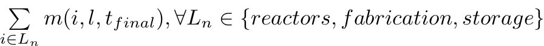
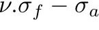

#Canonical desciption of the Open Fuel Cycle Benchmark (OFCB)

This directory aims to hold the canonical problem definitons.
To simplify exchange and comparison between different tool, We strongly recommend to use the same architeckture in the own tool directories...

#Contains

Each test folder contain the specific input for the corresponding test.

In each folder you will find a json file[1], with suppose to be a canonical description of the fuel cycle one try to describe.

#Generic test definition

## Problems based on decay only:

1. **Decay induced by heavy isotopes initial storage**
2. **Decay induced by fission products initial storage**

##Problems based on a once-through cycle:

1. **120 year simulation, single reactor, fixed fuel recipe, 120 years operation** 
2. **120 year simulation, two reactors, fixed fuel recipe, 120 years operation**
3. **120 year simulation, ten reactors, fixed fuel recipe, 120 years operation**
4. **120 year simulation, two reactors, fixed fuel recipe, first reactor operates for 120 years, second reactor starts at midpoint**
5. **120 year simulation, ten reactors, fixed fuel recipe, a new reactor starts every 10 years and continues throughout simulation**
6. **120 year simulation, single reactor, fixed fuel recipe, 60 years operation replaced by another reactor**
7. **120 year simulation, two reactors, fixed fuel recipe, each has 60 years operation replaced by another reactor**
8. **120 year simulation, ten reactors, fixed fuel recipe, each has 60 years operation replaced by another reactor**
9. **120 year simulation, two reactors, fixed fuel recipe, reactor A: operates 20 years, replaced by 60 year reactor and another 60 year reactor, reactor B: operates 40 years, replaced by 60 year reactor and another 60 year reactor**
10. **120 year simulation, ten reactors, fixed fuel recipe, reactor lifetimes are staggered, with a new reactor shutting down/replaced each 10 years**

#Reactor requirements (to be defined/completed)
* Physics models
  - Fuel Loading Model
  - Mean Cross Section Predictor
  - Bateman Solver
* Reactor(s) (over specified to accommodate different code requirements)
  - Thermal power
  - Cycle length
  - Heavy Metal mass in core
  - Fuel burnup
  - Fresh fuel composition
  - Spent fuel composition
* Cooling Pool
* Fabrication Plant
* Separation Plant
* Storage

#Outputs for Comparison
The complete set of results is represented by the mass inventories as a function of time (t) at each location (l) in the fuel cycle, m(i,l,t).  For any comparison, a lower fidelity may be necessary.

Define sets of important isotopes:
  * U + Pu
  * U + Pu + MA
  * FPs
  * Fissile isotopes

Define a notation for sets of similar facilities, e.g. all reactors, all fabrication, all storage
  * \sum_i m(i,l,tfinal) 
  *   for Ln in {reactors, fabrication, storage}
  * total inventory as a function of time of the above isotopes
  * facility dependent inventory 

The complete set of results for facility utilization is the throughput/production as a function of time (t) at each location (l), p(l,t).  There is also a theoretical maximum throughput/production as a function of time at each location, q(l,t).  Metrics of interest include:
  * q(l,t)
  * p(l,t)
  * p(l,t)/q(l,t)

Mathematical operation for comparisons:
  * RMS difference of isotope vector
    * problems:
      * swamped by errors on majority isotopes
      * some nuclides are more important
  * provide “importance” weighting for each isotope (default = 1)
    * prior work: list A from thesis B
    * perhaps different weighting vectors for different metrics
      * reactivity ( vs. full sensitivity analysis a la Tsunami)
      * decay heat
      * radiotoxicity
      * information provided to end metric

#Past Benchmark Work

* [ANS Summary](https://drive.google.com/file/d/0B6_Oqvcg8eP9TTJGdW44bGdlQTg/view?usp=sharing)

#References

  . [1] the JSON format specification can be found in the [JSON\_format_specification.rst](../JSON_format_specification.rst) file.
  . [2] [TSUNAMI Tools for Sensitivity and UNcertainty Analysis Methodology Implementation](http://scale.ornl.gov/tsunami/).
